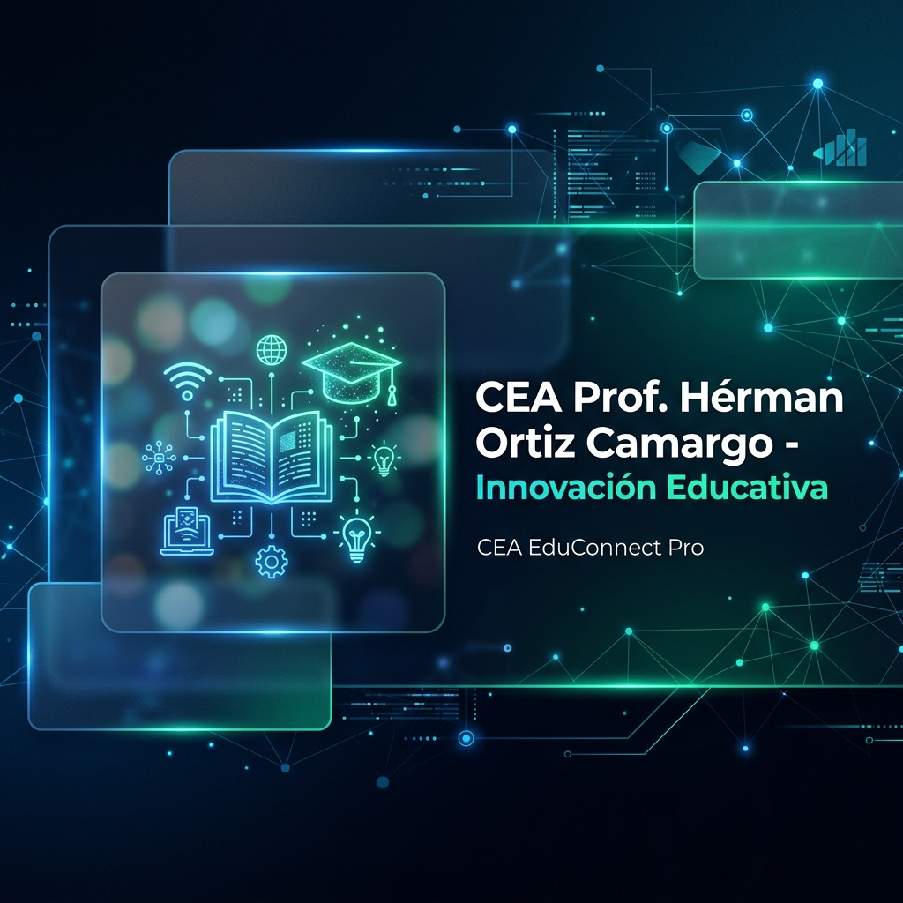

# 🎓 CEA EduConnect Pro — Ecosistema Educativo de Nueva Generación

## 🚀 Visión General
**CEA EduConnect Pro** es una plataforma LMS (Learning Management System) y ERP académico de alto rendimiento, diseñada específicamente para el **CEA Prof. Hérman Ortiz Camargo**. Combina una estética moderna basada en *Glassmorphism* con una arquitectura robusta para gestionar la educación secundaria de adultos y técnica tecnológica.

---

## 🏗️ Arquitectura del Sistema
El ecosistema está desacoplado en dos capas principales:
- **Backend (API Pro):** Construido con **FastAPI (Python)** y **PostgreSQL**. Gestiona la seguridad JWT, persistencia de datos y lógica de negocio.
- **Frontend (Portal Central):** Implementado con **Vanilla HTML5, CSS3 (Modern Flexbox/Grid)** y **JavaScript ES6+**. Sin frameworks pesados para garantizar una carga ultrarrápida.

---

## 💎 Subsistemas y Módulos

### 1. 🏠 Portal Central (Hub)
Punto de entrada unificado con Single Sign-On (SSO). Redirige a los usuarios según su rol y mantiene la sesión activa en todos los módulos.

### 2. 📚 Aula Virtual (Gestión Académica)
- **Visualización Pro:** Módulos organizados por Carrera y Nivel (Básico, Auxiliar, Medio).
- **Filtro Inteligente:** Los estudiantes solo ven el contenido de su especialidad asignada.
- **Repositorio de Materiales:** Soporte para PDF, Videos, Tareas y Enlaces.
- **Panel Docente:** Herramientas para publicar material y calificar en tiempo real.

### 3. 🗳️ Subsistema de Elecciones (Democracia Digital)
- **Votación Blindada:** Sistema de voto único por carnet y token JWT.
- **Dashboard de Resultados:** Gráficos en tiempo real para el Director.
- **Gestión de Candidatos:** Perfiles completos con fotos, siglas y frentes políticos.

### 4. 📊 Gestión de Notas y Kardex
- **Cuadros de Calificación:** Cumplimiento de la Ley 070 (Ser, Saber, Hacer, Decidir).
- **Boletines Automáticos:** Generación de reportes de rendimiento por estudiante.
- **Kardex Digital:** Historial académico completo y centralizado.

### 5. 📑 Secretaría y Administración
- **Inscripción Masiva:** Carga de estudiantes vía Excel.
- **Emails Institucionales:** Generación automática de cuentas `@educonnect.com`.
- **Control de Asistencia:** Registro digital diario por módulo y docente.

---

## 📱 Características "Nivel Pro"
- **Diseño Ultra-Responsivo:** Adaptado para celulares, tablets y computadoras.
- **Modo Oscuro Nativo:** Interfaz diseñada para reducir la fatiga visual.
- **PWA Ready:** Instalable en dispositivos móviles como una aplicación nativa.
- **SEO & Social Media:** Meta-tags optimizados para previsualizaciones premium al compartir el enlace.

---

## 🛠️ Instalación y Despliegue
1. **Backend:** Configurar `DATABASE_URL` en `.env` y ejecutar `uvicorn main:app`.
2. **Frontend:** Servir la carpeta `frontend/` mediante cualquier servidor estático (Nginx, Render, Netlify).
3. **Base de Datos:** Ejecutar el endpoint `/modulos/reset-ingenieria` para inicializar la malla curricular oficial del CEA.

---
**Desarrollado con ❤️ para la excelencia educativa.**
*CEA Prof. Hérman Ortiz Camargo — Pailón, Bolivia.*
